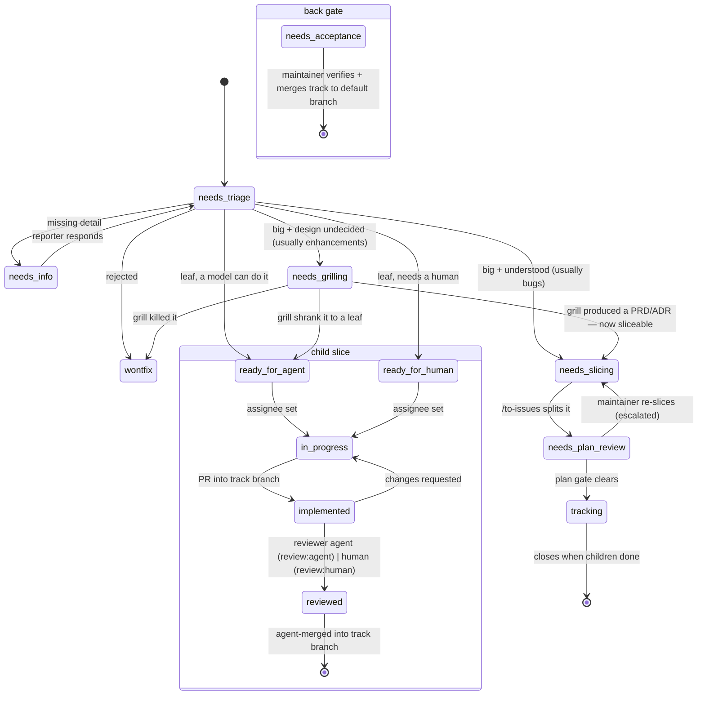

<!--
  Flow profile — scaffolded by /setup-flow.
  This is the project profile the `flow` skill reads. Customise the Tracker access
  block, the Track-execution placeholders (verify gate, in-situ harness, reviewer-agent
  command), and (only if your tracker uses different label strings) the role↔label
  mapping. The state machine below is the portable default (ADR-0022 + ADR-0036).
-->

# Flow profile

The **project profile** the `flow` skill reads: everything this repo's issue tracker +
delivery lifecycle needs that a portable skill must not hard-code. The skill carries the
*machine*; this file carries the *specifics*. (Domain vocabulary, if you keep a
`CONTEXT.md`, is a separate concern — this file is the **process** profile.)

> **Supersession.** This profile is the canonical delivery machine for this repo. It
> **extends and supersedes** the generic `triage` / `github-triage` / `triage-issue`
> skills, whose 5-state machine is a subset of the one below. Don't follow those skills
> literally here, and don't edit them — they're user-global and re-installable. Repo
> specifics live here. (Recording the rationale in an ADR is recommended — for the shape
> below, ADR-0022 covers the triage core and ADR-0036 the autonomous-track lifecycle.)

## Tracker access

- **Tracker:** GitHub Issues, via the `gh` CLI.
- **Repo:** `github.com/{{REPO}}` (infer from `git remote` if unsure).
- **AI disclaimer:** every comment or issue body posted during flow starts with
  `> *This was generated by AI during triage.*`
- **Out-of-scope knowledge base:** `.out-of-scope/*.md` (wontfix enhancements are written
  here and linked from the closing comment).

## Roles (state axis — exactly one per issue)

Canonical role ↔ this repo's label string (default: identical — edit only if they differ):

| Canonical role | Label | Meaning |
| --- | --- | --- |
| `needs-triage` | `needs-triage` | Maintainer needs to evaluate this issue. |
| `needs-info` | `needs-info` | Waiting on the reporter for more information. |
| `needs-grilling` | `needs-grilling` | Big and the **solution is undecided** — a human runs a design grill and produces the design artifact (a PRD and/or ADR) before it can be sliced. Usually enhancements; occasionally a design-laden architectural bug. |
| `needs-slicing` | `needs-slicing` | **Understood** and too big to assign. Run `/to-issues` to decompose; the parent then enters `needs-plan-review`. (If the solution is still undecided, it's `needs-grilling` first.) |
| `needs-plan-review` | `needs-plan-review` | A freshly-sliced **tracking parent** awaiting the plan gate: a reviewer agent validates the slice set and judges risk, then clears to `tracking` or escalates to the maintainer. |
| `tracking` | `tracking` | A **tracking parent** cleared to run — a container whose child slices execute autonomously. Never worked directly; closes when its children are done. |
| `ready-for-agent` | `ready-for-agent` | Fully specified to the agent floor; an agent can execute it unattended. Carries an `effort:` label. |
| `ready-for-human` | `ready-for-human` | A leaf a human must **implement** (judgment calls, external access, manual testing). *Not* "too big" (`needs-slicing`) and *not* "accept the result" (`needs-acceptance`). |
| `needs-acceptance` | `needs-acceptance` | The single back-gate child of a track: a human **verifies and accepts the integrated feature**, then merges the track branch to the default branch. `Depends on:` every slice. |
| `wontfix` | `wontfix` | Will not be actioned. |

Every triaged issue carries exactly **one** role label and **one** category label
(`bug` / `enhancement`). Conflicting role labels → flag and ask before acting.

**Front-bookend routing — grill vs slice.** For a big issue, the split is "is the
*solution* undecided?", **not** the category: undecided → `needs-grilling` (design it
first via your project's grilling/PRD skills; usually enhancements, also a design-laden
architectural bug); understood-but-big → `needs-slicing` (decompose; usually bugs). The
skill **surfaces** the grilling queue and **hands off** to the grilling skill — it never
runs the grill itself (a grill is an interview with the maintainer).

## Effort axis (on `ready-for-agent` leaves)

Signals how much reasoning *executing* the issue takes — track effort, **not** the model
(the roster churns faster than the issues). `effort:high` is a decompose-smell (prefer
`needs-slicing`) **and** a plan-gate escalation trigger.

| Label | Meaning |
| --- | --- |
| `effort:low` | Mechanical — near-zero reasoning. |
| `effort:medium` | Specified but needs care. |
| `effort:high` | Reasoning-heavy even when fully specified (usually: slice it). |

## Review axis (orthogonal policy) — default agent

Who reviews a slice's PR into the track branch. **Default agent**; human is the exception.

| Label | Meaning |
| --- | --- |
| `review:agent` | **Default.** An independent reviewer agent (fresh context, never the implementer) gates the merge into the track branch. |
| `review:human` | **Exception.** Escalate *this* slice to a human reviewer before it merges (same triggers as the plan gate). |

Absent ⇒ the default. The whole-feature human judgment is the `needs-acceptance` back
gate, not a per-slice `review:` label.

## Track execution

A **feature track** (a `tracking` parent + its slices) runs with the human at two
bookends and an autonomous middle.

- **Branch model.** The track gets one **track branch** `track/<slug>` off the default
  branch. Slices PR off the *track branch* and merge into it (reviewer-agent-gated,
  agent-merged). Only the track branch PRs off the default branch, **maintainer-merged**
  after acceptance. Agents never touch the default branch. Keep tracks short; merge the
  default branch into the track branch periodically (merge, not rebase).
- **Plan gate (`needs-plan-review`).** After `/to-issues`, a reviewer agent validates each
  child against the agent-ready bar and judges risk. Default → advance to `tracking` and
  create the track branch. Escalate → leave in `needs-plan-review` and ping the maintainer.
- **Autonomous middle.** Per assignable slice: implement on a slice branch off the track
  branch; get the verify gate green; an independent reviewer agent gates it; agent-merge
  into the track branch.
- **Acceptance (`needs-acceptance`).** Once all slices merged: the maintainer verifies the
  integrated feature, then merges the track branch to the default branch. Reject → a
  corrective issue on the track branch.

Fill these for your repo:

- **Verify gate** (run before review): `<your lint + typecheck + test + build command>`
- **In-situ verification harness** (UI-bearing slices, if any): `<e.g. a CDP/dev harness>`
- **Reviewer-agent command**: `<e.g. /code-review>`

## Derived states — never hand-labelled

Computed from existing signals, not stored as labels. Read them off the source.

| Derived state | Source of truth |
| --- | --- |
| **blocked** | An open dependency in the issue's dependency section — a `Depends on: #n` line or a `## Blocked by` list (`/to-issues` emits the latter). Any referenced issue still open ⇒ blocked. Refs elsewhere in the body don't count. |
| **in-progress** | The issue has an **assignee** (a tool/human claims a `ready-*` issue by self-assigning). |
| **implemented** | A linked PR is open (into the track branch). |
| **reviewed** | The linked PR is approved (reviewer agent or human) / merged. |

## State machine

The maintainer can override any state directly — flag transitions that look unusual.

## At-a-glance queries

| You want | Query |
| --- | --- |
| My grilling queue | `gh issue list --label needs-grilling` → run the grilling/PRD skills. |
| My slicing queue | `gh issue list --label needs-slicing` → run `/to-issues`. |
| Tracks awaiting the plan gate | `--label needs-plan-review`. |
| Agent-assignable now | `--label ready-for-agent`, minus any with an open `Depends on:`. |
| My acceptance queue | `--label needs-acceptance`, minus blocked. |
| My build queue | `--label ready-for-human`, minus blocked. |
| Running tracks | `--label tracking`. |
